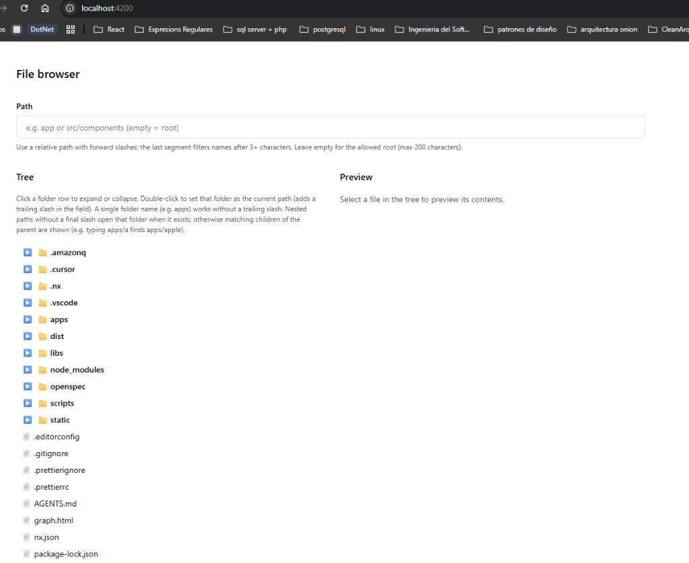
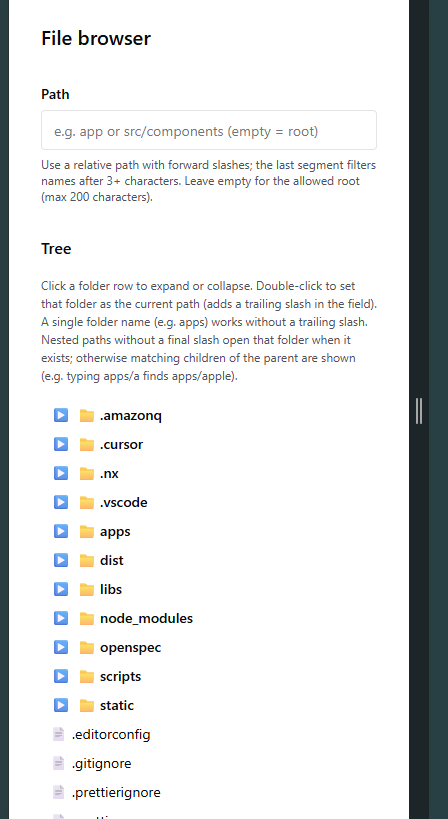
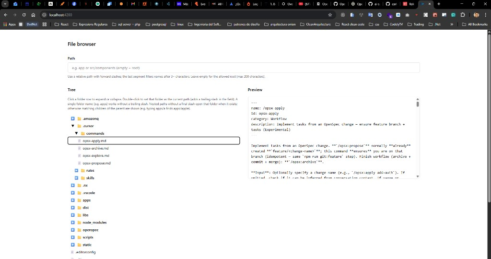
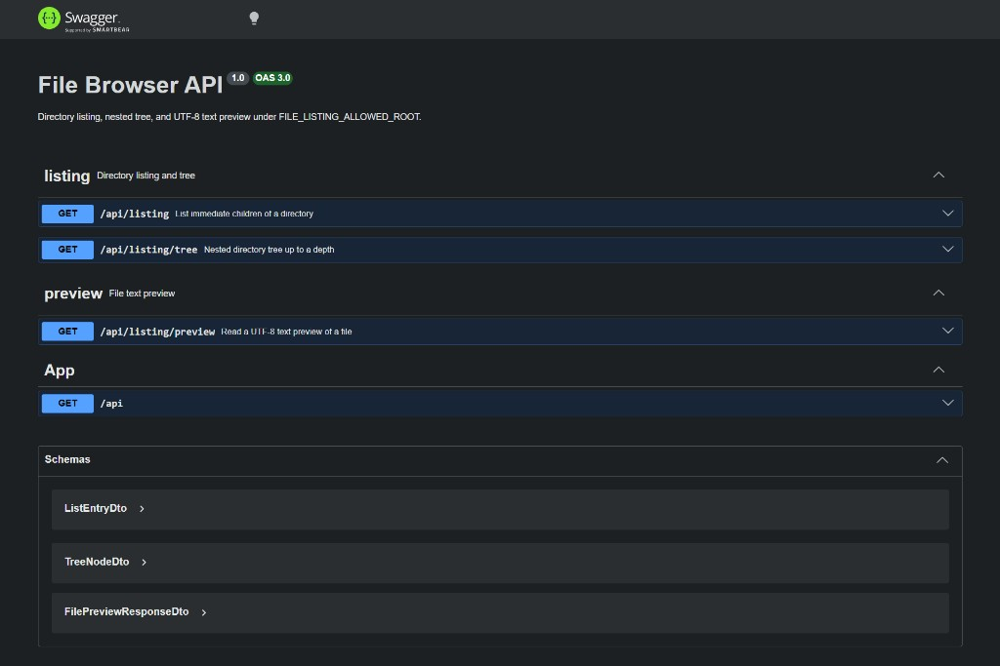

# File Browser Workspace

Nx monorepo with **NestJS 11** (API) and **React 18** (web): browse files and folders under a configurable **allowed root** on the host, preview UTF-8 text files, and keep behavior **spec-driven** with **OpenSpec**.

## Package manager

This repo uses **pnpm** only: **`pnpm-lock.yaml`** at the root is the single lockfile. Use **[Corepack](https://nodejs.org/api/corepack.html)** (`corepack enable`) so the **`packageManager`** field in **`package.json`** pins **pnpm 9** — do not commit **`package-lock.json`** or **`yarn.lock`**.

## What this project is

- **Backend** exposes REST endpoints for directory **listing**, a nested **tree**, and **text preview** of files (see [Swagger UI](#openapi--swagger) when the API is running).
- **Frontend** is a **file browser** page: path field, lazy expandable tree, and side-by-side **preview** when you select a file.

Screenshots (repository root with `package.json` selected — preview shows JSON):

| Desktop | Mobile (narrow viewport) |
|---------|---------------------------|
|  |  |

With a file open in the preview panel (example: `.cursor/commands/opsx-apply.md`):



## Why OpenSpec

Features are developed as **OpenSpec changes** under `openspec/changes/<change-id>/`: **proposal** (why), **design** (how), **specs** (what the system must do), and **tasks** (checklist). That keeps **AGENTS.md** architecture rules, **Git** (`feature/<change-id>` on **`trunk`**), and **tests** aligned so implementation does not drift from agreed behavior.

## Stack

| Layer | Technology |
|-------|------------|
| Monorepo | **Nx** |
| API | **NestJS 11**, **Swagger** (`/api/docs`) |
| Web | **React 18**, **Vite**, **Chakra UI**, **TanStack Query** |
| Tests | **Vitest** (unit), **Playwright** (web e2e), **Jest** (api e2e) |
| Quality | **ESLint** + TypeScript |

## Commands

| Command | Description |
|--------|-------------|
| `pnpm run dev` | API + web (API first, then Vite on port 4200) |
| `pnpm run serve:api` | NestJS API → `http://localhost:3000/api` |
| `pnpm run serve:web` | Vite dev server → `http://localhost:4200` (proxies `/api` to 3000) |
| `pnpm run build:api` / `pnpm run build:web` | Production builds |
| `pnpm run lint` | ESLint for `apps/web/src` and `apps/api/src` |
| `pnpm test` | Vitest for **api** and **web** |
| `pnpm run verify` | **`lint`** then **`pnpm test`** (recommended before merge/archive) |
| `pnpm exec nx e2e web-e2e` | Playwright (starts **api:serve**; Nx runs **web:preview** first) |
| `pnpm exec nx e2e api-e2e` | Jest e2e against a running API (see Nx `dependsOn`) |
| `pnpm run git:feature -- <change-id>` | Create/switch to `feature/<change-id>` from **`trunk`** |

### OpenAPI / Swagger

With the API running: **Swagger UI** → [http://localhost:3000/api/docs](http://localhost:3000/api/docs)  
OpenAPI JSON: [http://localhost:3000/api/docs-json](http://localhost:3000/api/docs-json) (Nest default path may vary slightly; use the UI link as source of truth.)

If you see a JSON 404 at `/api/docs` (`Cannot GET /api/docs`), Swagger is not mounted under the global `api` prefix — use `SwaggerModule.setup(..., { useGlobalPrefix: true })` in `apps/api/src/main.ts` and restart the API.



## Configuration

- **`FILE_LISTING_ALLOWED_ROOT`** — Absolute path the API may read. Default: `process.cwd()` (the directory used to start the server). Set explicitly in production.
- **Symlinks / traversal** — Documented in OpenSpec **`cross-platform-path-file-listing`**.

## E2E prerequisites

- **Web e2e:** Nx runs **`web:preview`** and Playwright starts **`api:serve`** so `/api` is available. Optionally run **`pnpm run dev`** in another terminal and use Playwright **`reuseExistingServer`** (already enabled).
- **API e2e:** Targets depend on **`api:serve`**; ensure port **3000** (or `PORT`) matches `apps/api-e2e` axios base URL.

## Example: hypothetical feature — “Download file”

Suppose you want a **download** action for the selected file (business-relevant, fits the file browser).

1. **Branch + OpenSpec change**
   ```bash
   pnpm run git:feature -- file-browser-file-download
   openspec new change "file-browser-file-download"
   ```
2. **Author** `proposal.md`, `design.md`, `specs/…`, `tasks.md` (or use **`/opsx:propose`** to scaffold).
3. **Implement** (`/opsx:apply` or follow `tasks.md`): e.g. `GET /api/listing/download?path=…` + web button calling it.
4. **Verify**
   ```bash
   pnpm run verify
   pnpm exec nx e2e web-e2e
   ```
5. **Archive + Git** (on green): **`/opsx:archive`** — moves the change under `openspec/changes/archive/YYYY-MM-DD-file-browser-file-download/`, conventional commit, merge to **`trunk`**.

Full workflow details: **`AGENTS.md`**.

## Structure

```
file-browser-workspace/
├── apps/
│   ├── api/              # NestJS — feature modules under src/app
│   ├── api-e2e/          # Jest + axios e2e
│   ├── web/              # React — features under src/app
│   └── web-e2e/          # Playwright
├── docs/readme/          # README screenshots
├── libs/shared/
└── openspec/             # Active + archived OpenSpec changes
```

## Conventions

- **Git:** default integration branch **`trunk`** (`pnpm run git:feature`, **`AGENTS.md`**).
- **Code:** vertical slices, thin UI, **`pnpm run lint`** + **`pnpm test`** before treating work as done.
